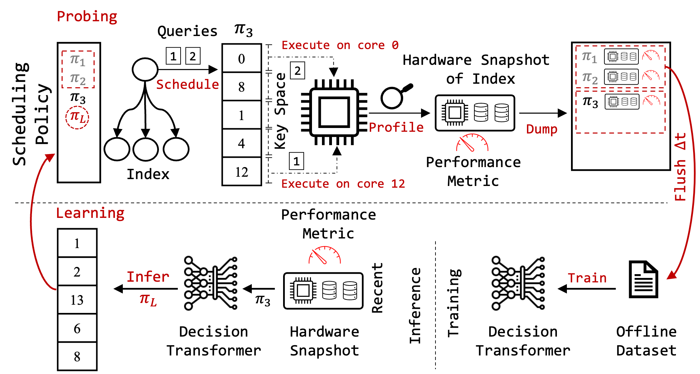
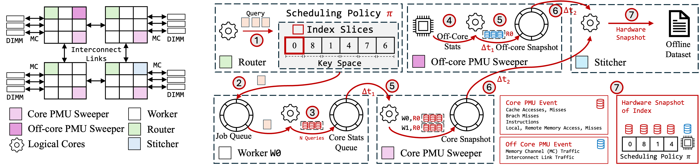

# P-MOSS: Learned Scheduling For Indexes Over NUMA Servers Using Low-Level Hardware Statistic

P-MOSS is a learned Performance MOnitoring Unit (PMU) driven Spatial Query Scheduling framework, that utilizes spatial query scheduling to improve the query execution performance of main memory indexes in NUMA servers. There are 2 component to PMOSS: a system component and a learned component. This repo contains the code for the system component of PMOSS.


Architecture Overview
--------------------------------------------------------------------------------



System Component Architecture
--------------------------------------------------------------------------------


Building System Component of PMOSS
--------------------------------------------------------------------------------
Install cmake and then:
```
mkdir build
cd build
cmake ..
cmake --build .
```

